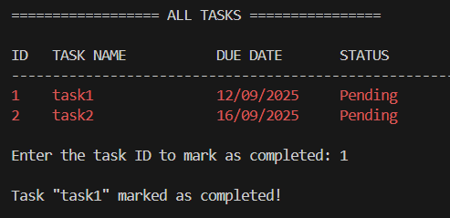

# Simple-Task-List-Application
A command-line task list application implemented in C++ that helps users efficiently organize their daily tasks with various management options. 

## Features
- Add new tasks.
- View all tasks.
- Mark tasks as completed.
- Delete tasks.
- Sort tasks by due date .
- Filter tasks by status (Completed / Pending).
- Color-coded tasks:
  - Green = Completed
  - Red = Pending

## Prerequisites
- C++ compiler 
- Git (for cloning the repository)

## Getting Start
### 1. Clone the repository:
 ```bash
git clone https://github.com/TAN0816/Simple-Task-List-Application.git
cd Simple-Task-List-Application
 ```

### 2. Compile the program:
```bash
g++ main.cpp task.cpp task_functions.cpp -o task-list
 ```

### 3. Run the program:
```bash
./task-list.exe
 ```

## Screenshots
##### Main Menu


##### Add Task


##### View Tasks


##### Mark Task as Completed


##### Delete Task


##### Sort Tasks by Due Date


##### Filter Tasks by Status


## Testing Document
Here is the detailed testing documentation:  
[View Testing Document](./Testing_Document.pdf)
